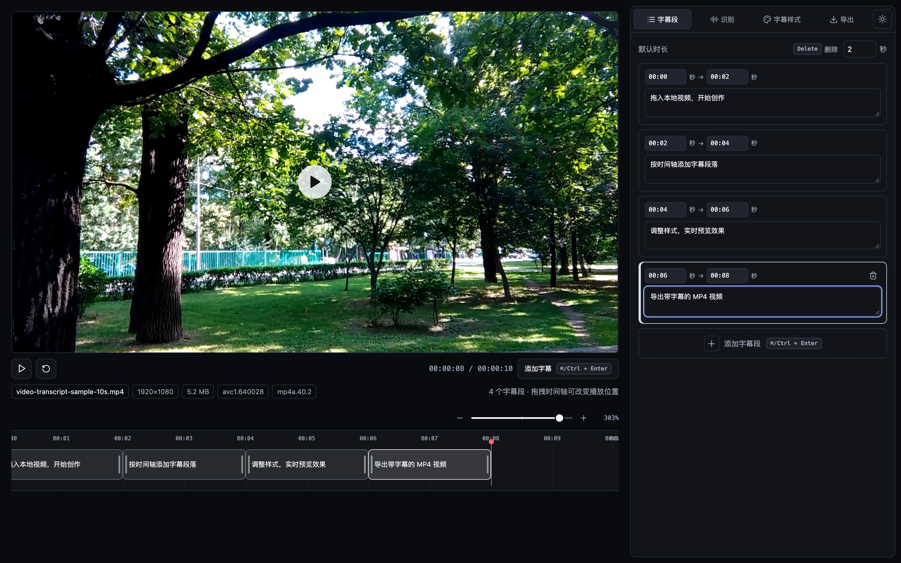

  
  <h1>Video Transcript</h1>
  
字幕工作室 · 在浏览器中完成视频字幕编辑与烧录，全程本地处理。

  

    <strong>无需账号</strong> · <strong>无需后端</strong> · <strong>无水印</strong>
  

  

    <a href="https://video-transcript.zishu.me">立即体验</a>
  

  

## 产品简介

Video Transcript（字幕工作室）是一款运行在浏览器中的视频字幕编辑工具，用于为本地 MP4 视频添加、调整和烧录字幕。

导入视频后，你可以在时间轴上分段、编辑文字和设置样式，并实时预览字幕在画面中的最终效果。完成后直接导出带有字幕的 MP4，视频、字幕和导出过程都只在当前设备上完成，不会上传到服务器。

## 核心能力

| 功能           | 说明                                                               |
| -------------- | ------------------------------------------------------------------ |
| 本地视频导入   | 拖拽或选择 MP4，快速查看分辨率、时长、体积、编码与音轨信息         |
| 时间轴编辑     | 添加、删除、复制字幕段，拖拽调整起止时间，并与视频播放进度联动     |
| 实时字幕预览   | 字幕按时间轴叠加在视频画面上，编辑结果即时可见                     |
| 灵活的字幕样式 | 内置多套预设，可调整背景色、文字色、字号、不透明度、位置和对齐方式 |
| 分段样式覆盖   | 既可统一设置全局样式，也可单独调整某个字幕段                       |
| 多档 MP4 导出  | 提供接近原画、4K 上限、1080p 上限三档画质，并支持保留 AAC 音轨     |
| 连续编辑       | 自动保存编辑状态和最近使用的视频，下次打开可继续处理               |
| 明暗主题       | 支持深色与浅色界面，适应不同使用环境                               |

## 怎么使用

1. 拖入或选择一个本地 MP4 视频。
2. 播放视频定位时间点，点击“添加字幕”创建字幕段。
3. 在右侧时间轴列表中编辑字幕文字，拖动时间轴字幕块调整起止时间。
4. 在“字幕样式”中设置全局样式，或为当前字幕段单独覆盖样式。
5. 进入“导出”，选择画质和音轨选项，导出带字幕的 MP4。

## 兼容性

Video Transcript 推荐使用最新版 Chrome 或 Edge。Safari 和部分视频编码格式可能受到浏览器能力限制；当设备无法解码视频或导出 H.264 文件时，界面会给出明确提示。

## 视频规模与性能建议

产品没有设置固定的视频大小或时长上限，实际可用规模取决于设备的内存、性能和视频编码格式。视频越大，处理时需要的内存越多，导出失败的风险也越高。

推荐使用 H.264 视频轨道和 AAC 音轨。以下是桌面版 Chrome / Edge 的经验参考，并非硬性保证：

| 场景                    | 建议                                                                                           |
| ----------------------- | ---------------------------------------------------------------------------------------------- |
| 稳妥的日常使用          | 1080p、30fps、5-20 分钟，源文件 200MB-1GB                                                      |
| 16GB 内存设备           | 1080p，建议不超过 30 分钟、源文件 1GB 左右                                                     |
| 32GB 内存设备的极限尝试 | 1080p，可尝试 60 分钟、源文件 2GB 左右；或 4K，20-30 分钟、2-4GB，但可能因编码器或内存限制失败 |
| 不建议                  | 源文件超过 2GB、2 小时以上的 1080p、长时间 4K、8K，以及移动端处理大文件                        |

如果只需要预览和调整字幕，通常可以处理比导出更大的视频。长时间 4K 视频建议选择“标准”画质，将导出分辨率限制在 1080p，以提高成功率。

字幕烧录会重新编码视频轨道，因此导出文件体积可能与原视频不同。导出码率默认参考源视频的平均码率，再根据输出分辨率、源编码格式和画质档位调整，最高限制为 `80 Mbps`；当源文件没有提供码率信息时，会按分辨率和帧率估算。实际结果仍会因视频内容、浏览器编码器和音频码率略有差异。

## 数据与隐私

- 视频、字幕和导出结果始终保留在当前浏览器中，不会上传到服务器。
- 最近使用的视频与编辑状态会保存在本地，方便下次继续编辑。
- 清理浏览器站点数据会同时删除这些本地内容。
- 超大视频可能受浏览器存储空间限制，无法在关闭页面后恢复。
